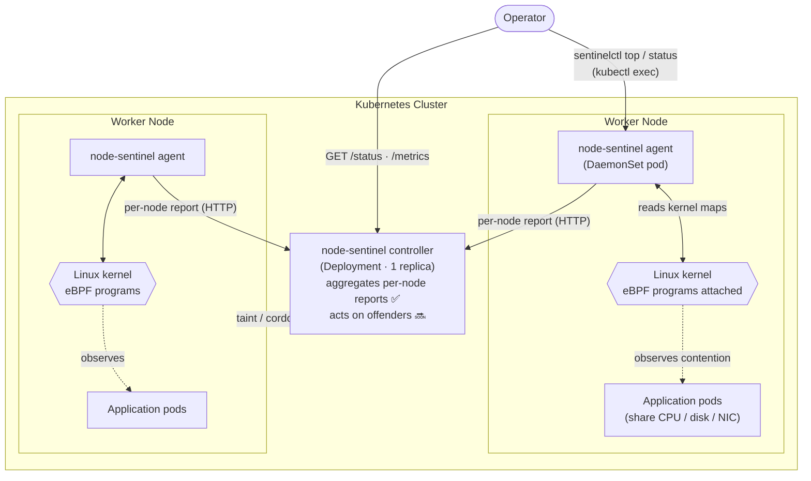
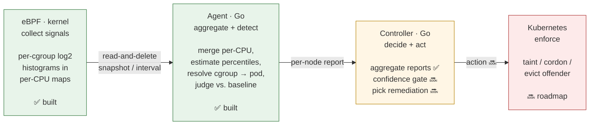
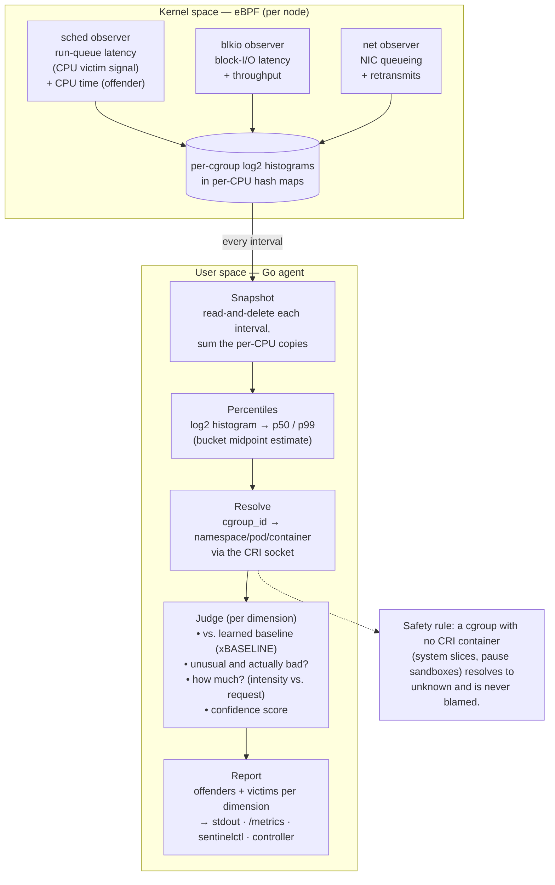

# Architecture — node-sentinel at a glance

How the pieces fit, in three pictures: **where it runs**, **how data flows**, and **how one agent turns kernel events into a verdict**. Plain-English model is in [`CONCEPTS.md`](CONCEPTS.md); the eBPF build/run mechanics are in [`HOW.md`](HOW.md); the formal design is in [`docs/`](.).

Each box is tagged ✅ **built** or 🔜 **roadmap** so you can tell today's behaviour from where it's heading.

---

## 1. Where it runs — deployment topology

One **agent** per node (a DaemonSet), one **controller** per cluster (a Deployment). The agent is self-contained: it works even with no controller. The controller only *aggregates* today — it does not act.

**Read it as:** every node watches its own kernel and reports up; the operator can look at a single node live (`sentinelctl`) or the whole cluster (the controller). The dashed arrow back into the cluster — remediation — is the roadmap half.

---

## 2. How data flows — the forward-only pipeline

Each stage hands off to the next and **never calls back**. Signals are born in the kernel and travel one direction: kernel → agent → controller → Kubernetes.

Green = built and running today. Amber = partially built (the controller aggregates but doesn't yet decide). Red = roadmap.

---

## 3. Inside one agent — kernel events to a verdict

What happens between "a task wakes up" and "this pod is OVER its fair share." Three observers feed the same detection path, once per interval (default 5s).

**The honest-attribution guarantee lives here:** if a cgroup can't be tied to a real Kubernetes container, it's labelled `unknown` and never attributed — so the system would rather say "can't tell" than blame the wrong pod. That same caution is why offenders carry a **confidence** score and low-confidence findings are *alert-only*, never acted on.

---

## Where each box lives in the tree

| Picture box | Package / file |
|---|---|
| eBPF observers (CPU / disk / net) | `internal/ebpf/bpf/*.bpf.c` + `internal/ebpf/{loader,sched,…}.go` |
| Snapshot + percentiles | `internal/ebpf` (read-and-delete) + `internal/metrics/histogram.go` |
| cgroup → pod resolver | `internal/cgroup/resolver.go` |
| Judge / baseline / confidence | `internal/metrics` (judgement) |
| Agent lifecycle | `internal/agent/*` + `cmd/agent/main.go` |
| Controller (aggregate) | `internal/controller/*` + `cmd/controller/main.go` |
| Live CLI | `cmd/sentinelctl` |

Layout follows design §7.2.1. For the numbers behind each stage (event rates, map sizes, overhead), see [`docs/node-sentinel-internals.md`](node-sentinel-internals.md).
