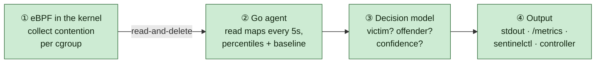
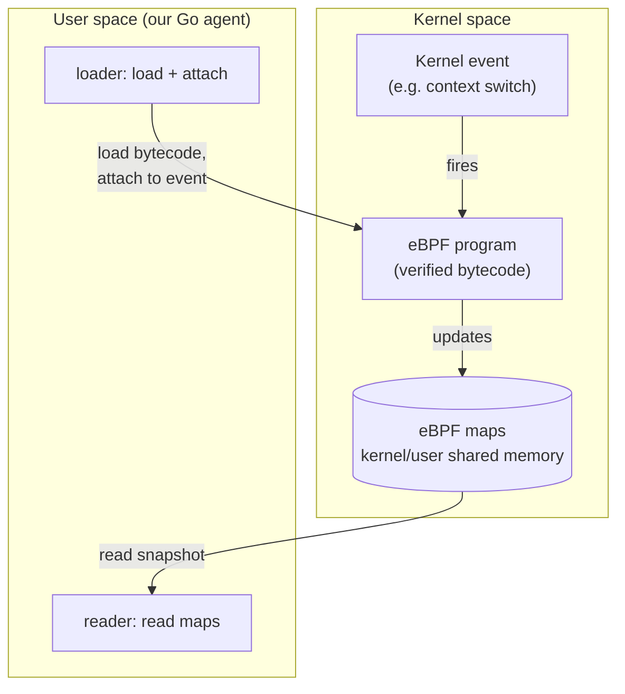
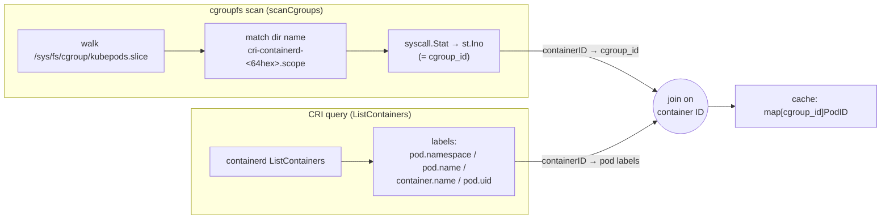
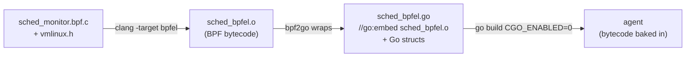
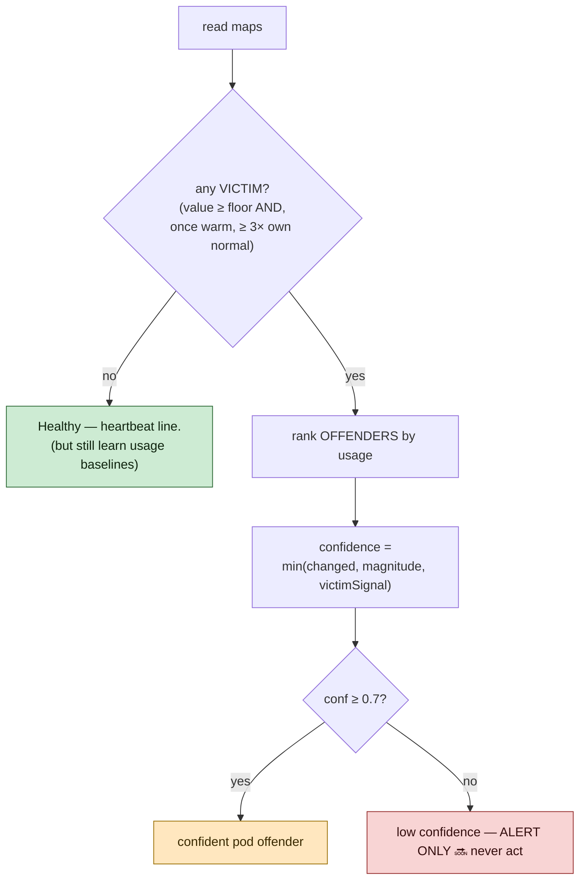
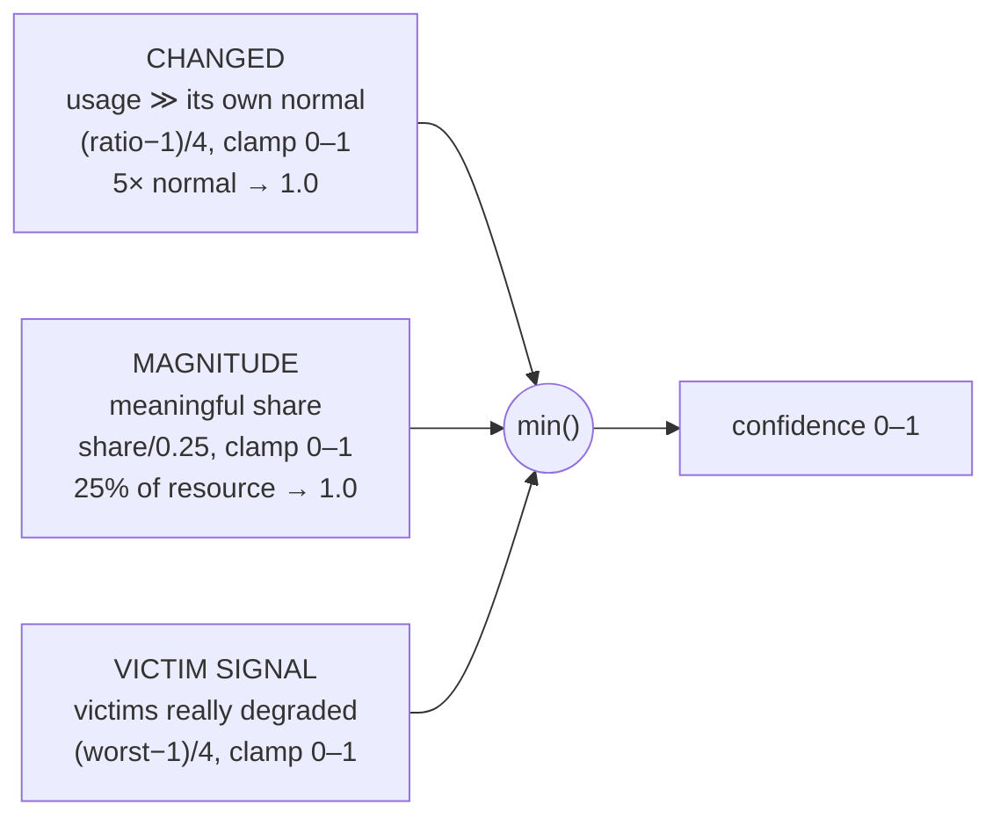
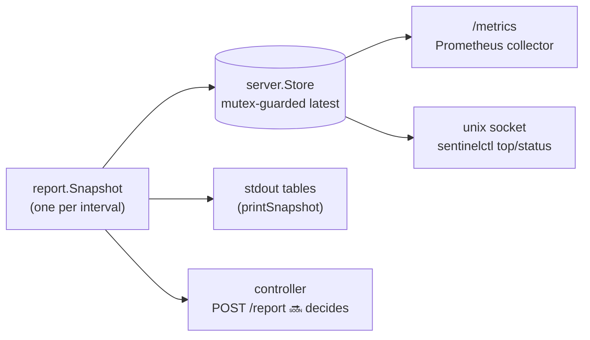
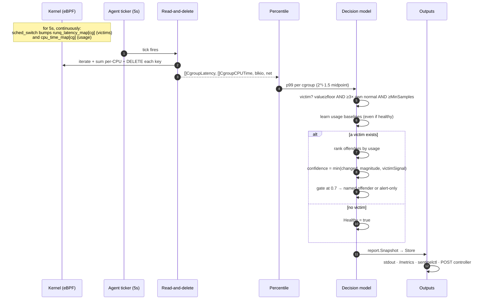

# node-sentinel — The Deep Dive ("GOD book")

> **Who this is for.** Anyone who wants to understand node-sentinel from the
> ground up — a kernel novice, a Go developer who has never written eBPF, a
> university student, an SRE evaluating the tool. By the end you should be able
> to explain *every* number the agent prints and point to the exact line of code
> that produced it.
>
> **How to read it.** Sections build on each other. If you only want the mental
> model, read [§0](#0-the-one-paragraph-version) and [§7](#7-from-numbers-to-a-verdict--the-decision-model).
> If you want to hack on the kernel code, read [§2](#2-what-is-ebpf)–[§6](#6-how-go-reads-the-data).
> The plain-English analogy version lives in [`CONCEPTS.md`](CONCEPTS.md); the
> three architecture diagrams in [`ARCHITECTURE.md`](ARCHITECTURE.md); the build
> mechanics in [`HOW.md`](HOW.md). This document is the long-form union of all of
> them, traced down to individual struct fields.

Every claim below is tagged ✅ **built** (in the code today) or 🔜 **roadmap**.

---

## Table of contents

0. [The one-paragraph version](#0-the-one-paragraph-version)
1. [Why build this at all](#1-why-build-this-at-all)
2. [What is eBPF](#2-what-is-ebpf)
3. [How we use eBPF to capture the data we need](#3-how-we-use-ebpf-to-capture-the-data-we-need)
4. [cgroups, PIDs, and the kernel internals we lean on](#4-cgroups-pids-and-the-kernel-internals-we-lean-on)
5. [How the C is embedded into Go](#5-how-the-c-is-embedded-into-go)
6. [How Go reads the data](#6-how-go-reads-the-data)
7. [From numbers to a verdict — the decision model](#7-from-numbers-to-a-verdict--the-decision-model)
8. [The output surfaces](#8-the-output-surfaces)
9. [End-to-end trace of a single interval](#9-end-to-end-trace-of-a-single-interval)
10. [Appendix: every tunable, every map, every probe](#10-appendix-every-tunable-every-map-every-probe)

---

## 0. The one-paragraph version

node-sentinel runs a small program **inside the Linux kernel** (eBPF) on every
node. That program watches three kinds of *contention* — tasks waiting for a
CPU, disk requests waiting to complete, and TCP segments being retransmitted —
and records them **per cgroup** (i.e. per container) into kernel memory. Once
every 5 seconds a Go agent in user space reads those kernel tables, converts the
raw histograms into percentiles, asks "is anyone being starved, and is that
unusual *for them*?", and if so tries to name the pod responsible — but only
with a **confidence score**, and only when it can honestly tie the cgroup to a
real Kubernetes container. It measures *harm*, not just *usage*, and it would
rather say "can't tell" than blame the wrong pod.



---

## 1. Why build this at all

### 1.1 The problem: the "noisy neighbour"

A Kubernetes node is a single physical machine whose CPU cores, disk, and NIC
are **shared** by every pod scheduled onto it. Kubernetes' scheduler places pods
based on *requests* (a promise of resources) but the kernel hands out the
*actual* hardware moment-to-moment. When one pod suddenly does far more work than
usual — a batch job kicks off, a memory leak triggers furious GC, a log flush
saturates the disk — its neighbours quietly suffer. Their requests get served
late. Their p99 latency climbs. Nobody crashed; nothing shows up as an error.
This is the **noisy-neighbour problem**.

### 1.2 Why existing tools don't close the loop

Most observability stacks measure **usage**: "pod X used 3 cores," "pod Y wrote
500 MB/s." Usage is necessary but not sufficient, because:

- **High usage is not the same as harm.** A pod allowed to burst to 8 cores on
  an idle node is using a lot and hurting nobody. The same 8 cores on a packed
  node starve everyone. Usage alone can't tell these apart.
- **The victim and the offender are different pods.** The pod whose latency
  spikes (the victim) is rarely the pod causing the contention (the offender).
  A dashboard that alerts on the victim points you at the wrong place.
- **Nobody acts.** Microscope-style tools (Inspektor Gadget, Pixie, Hubble) show
  you the kernel in beautiful detail but stop at *display*. Closing the loop —
  deciding an offender is real and doing something about it — is left to a human
  at 3am.

### 1.3 node-sentinel's wedge

node-sentinel measures **contention, not usage**, attributes it to a specific
pod **with a confidence score**, and is designed to **close the control loop**
(detect → decide → remediate) under policy.

| | Usage tools | Microscopes | **node-sentinel** |
|---|---|---|---|
| Measures | how much you used | everything, in detail | **how much others *waited*** |
| Output | graphs | graphs/traces | **a ranked, scored verdict** |
| Acts? | no | no | **🔜 taint / cordon / evict under a CRD policy** |

> **Honesty over coverage.** The single most important design value: a cgroup
> that can't be tied to a real container is labelled `unknown` and **never
> blamed**, and every offender carries a confidence score — low-confidence
> findings are *alert-only*. The system is built to be trusted enough to one day
> act automatically, which means it must never act on a guess.

**Today (Phase 1, ✅):** the detection half — the per-node agent — is built and
validated on a live cluster. **Roadmap (🔜):** the controller's decision engine,
the `NodeHealthPolicy` CRD, and remediation.

---

## 2. What is eBPF

### 2.1 The problem eBPF solves

To measure run-queue latency you must observe the scheduler *as it switches
tasks* — millions of times a second, deep inside the kernel. You have three
classical options, all bad:

1. **Poll `/proc` from user space.** Far too coarse and too slow; you'd see
   averages over seconds, never the microsecond-scale waits that matter, and the
   reading itself would burn CPU.
2. **Write a kernel module.** You get the access, but a bug panics the whole
   machine, and you must recompile per kernel version. Operationally radioactive.
3. **eBPF.** Run your code *inside* the kernel, at the exact events you care
   about — but in a **sandbox** the kernel proves safe before it runs.

eBPF is option 3: a way to load small programs into the running kernel that
execute when specific events fire (a context switch, a disk completion, a packet
send), with safety guarantees that a kernel module can't offer.

### 2.2 How eBPF stays safe — the verifier

eBPF programs are written in a restricted subset of C, compiled to **eBPF
bytecode** (a small RISC-like instruction set), and handed to the kernel. Before
the kernel runs a single instruction, the **verifier** statically proves:

- **It terminates.** No unbounded loops — the verifier walks every path. (This
  is why our `log2_bucket` loop is bounded by `bucket < MAX_SLOTS - 1`, and why
  helpers are marked `__always_inline`.)
- **Every memory access is in-bounds.** You cannot dereference a wild pointer.
  Every map lookup returns a pointer the verifier *forces* you to null-check
  before use — that's why you see `if (!hist) return 0;` after every
  `bpf_map_lookup_elem`.
- **It only touches what it's allowed to.** No arbitrary kernel memory, only
  helper functions and maps.

If any proof fails, the program is **rejected at load time** — it never runs.
This is the property that lets us attach to the hottest path in the kernel (the
scheduler) in production without risking a panic.

### 2.3 The pieces of an eBPF system



- **Program** — your code, attached to a *hook* (an event).
- **Maps** — typed key/value tables in kernel memory, **shared** with user
  space. This is the *only* channel from kernel to your agent. The kernel writes;
  the agent reads.
- **Helpers** — the small set of kernel functions a program may call
  (`bpf_ktime_get_ns()`, `bpf_map_lookup_elem()`, `bpf_get_current_cgroup_id()`).

### 2.4 CO-RE: "Compile Once, Run Everywhere"

Kernel struct layouts change between versions — the field you want
(`task->cgroups`) might sit at a different byte offset on kernel 5.10 vs 6.2. The
old way (BCC) shipped a compiler to every node and rebuilt per-boot. The modern
way is **CO-RE**:

- The kernel exposes its own type layout via **BTF** (BPF Type Format).
- You compile against a single description of kernel types: `vmlinux.h`
  (committed at `internal/ebpf/bpf/vmlinux.h`).
- Wherever you read a kernel field you wrap it in `BPF_CORE_READ(...)`, which
  emits a **relocation** instead of a hard-coded offset.
- At **load time** the kernel patches each relocation to the *running* kernel's
  actual offset.

The payoff for node-sentinel: **one** compiled `.o` works across kernels and (for
our probe types) across CPU architectures, so the whole build is hermetic and
ships as a multi-arch image with no per-node compilation. (More in [§5](#5-how-the-c-is-embedded-into-go).)

> **Why our probes are arch-independent.** We use only `tp_btf` raw tracepoints
> and `fentry` — never `pt_regs`/syscall-register probes, which *are*
> arch-specific. The bytecode is little-endian (`bpfel`); amd64 and arm64 are
> both LE, so one object serves both. That is the single fact that makes the
> Docker build cross-compile with no QEMU emulation.

---

## 3. How we use eBPF to capture the data we need

We run **three independent observers**, one per resource dimension. Each is a
separate `.bpf.c` file, separately loaded, and — crucially — **best-effort**: if
disk or network fails to attach, the agent logs a warning and keeps running with
whatever attached (`internal/agent/agent.go:62-78`).

| Observer | File | Hooks | Victim signal | Offender signal |
|---|---|---|---|---|
| **sched** (CPU) | `sched_monitor.bpf.c` | `tp_btf/sched_wakeup`, `sched_wakeup_new`, `sched_switch` | run-queue latency | on-CPU time |
| **blkio** (disk) | `blkio_monitor.bpf.c` | `tp_btf/block_rq_insert`, `block_rq_complete` | I/O completion latency | bytes moved |
| **net** | `net_monitor.bpf.c` | `tp_btf/tcp_retransmit_skb`, `fentry/tcp_sendmsg` | TCP retransmits | TX bytes |

The recurring shape across all three: **measure a duration or a count at a
kernel event, bucket it into a per-cgroup table, and let user space do the
math.** The kernel reduces; Go decides.

### 3.1 The CPU observer in detail (the canonical one)

This is the most important observer, so we trace it line by line.
(`internal/ebpf/bpf/sched_monitor.bpf.c`.)

**Run-queue latency** = how long a task that became *runnable* had to *wait*
before a CPU actually picked it up. If your task is ready to run but every core
is busy, that wait is the precise, kernel-true measure of CPU starvation. It is a
**victim-side** signal: it lights up on the pods being *hurt*.

To measure it we need two timestamps, captured at two different events, joined by
the task's PID:

```mermaid
sequenceDiagram
    participant W as sched_wakeup
    participant K as kernel (PID is runnable, waiting)
    participant S as sched_switch
    W->>W: t0 = ktime; wakeup_ts_map[pid] = t0
    Note over K: task sits in the run queue...
    S->>S: t1 = ktime; t0 = wakeup_ts_map[pid]
    S->>S: wait = (t1 - t0)/1000  µs
    S->>S: bucket into runq_latency_map[cgroup_of(next)]
    S->>S: delete wakeup_ts_map[pid]
```

Step 1 — **stamp the wakeup** (`handle_sched_wakeup`, lines 105-118):

```c
SEC("tp_btf/sched_wakeup")
int BPF_PROG(handle_sched_wakeup, struct task_struct *task)
{
    save_wakeup_time(BPF_CORE_READ(task, pid));   // wakeup_ts_map[pid] = now
    return 0;
}
```

`sched_wakeup_new` (a freshly `fork`ed task becoming runnable) does the same.

Step 2 — **on the context switch, measure the incoming task's wait**
(`handle_sched_switch`, lines 121-176). `prev` is leaving the CPU, `next` is
taking it:

```c
__u32 next_pid = BPF_CORE_READ(next, pid);
__u64 *wakeup_time = bpf_map_lookup_elem(&wakeup_ts_map, &next_pid);
if (!wakeup_time) return 0;                 // we never saw its wakeup; skip
__u64 wait_us = (now - *wakeup_time) / 1000;
bpf_map_delete_elem(&wakeup_ts_map, &next_pid);   // consume the stamp

__u64 cgroup_id = BPF_CORE_READ(next, cgroups, dfl_cgrp, kn, id);
// ... look up (or create) runq_latency_map[cgroup_id], then:
__sync_fetch_and_add(&hist->slots[bucket], 1);    // bump the histogram
__sync_fetch_and_add(&hist->total_us, wait_us);   // for the mean
__sync_fetch_and_add(&hist->count, 1);
```

The wait is **attributed to `next`'s cgroup** — the victim. `BPF_CORE_READ(next,
cgroups, dfl_cgrp, kn, id)` walks `task_struct → css_set → cgroup → kernfs_node →
id`; that final `id` is the number we key everything on (see [§4](#4-cgroups-pids-and-the-kernel-internals-we-lean-on)).

**On-CPU time** (the offender signal) is harvested *in the same `sched_switch`
handler*, before the victim logic, by charging the slice that just ended to the
*outgoing* task (`prev`):

```c
__u64 *slice_start = bpf_map_lookup_elem(&cpu_slice_start, &index); // per-CPU [1]
if (slice_start) {
    __u32 prev_pid = BPF_CORE_READ(prev, pid);
    if (*slice_start != 0 && prev_pid != 0) {   // skip first switch + idle (pid 0)
        __u64 cgroup_id = BPF_CORE_READ(prev, cgroups, dfl_cgrp, kn, id);
        add_cpu_time(cgroup_id, now - *slice_start);   // cpu_time_map[cgroup] += slice
    }
    *slice_start = now;                          // this CPU's new slice starts now
}
```

`cpu_slice_start` is a `PERCPU_ARRAY` of size 1 — effectively "the time the task
currently on *this* core started running." At each switch we close the previous
slice and open a new one. Idle (PID 0) is excluded: idle time is nobody's usage.

> **Why run-queue latency finds victims, not offenders.** A CPU-hog rarely
> sleeps, so it generates very few wakeup→switch events — it barely shows up in
> the *latency* histogram. That's exactly why we *also* collect on-CPU time: the
> hog dominates `cpu_time_map` even while it's invisible in `runq_latency_map`.
> The two signals are complementary halves of one story. Never read a high-p99
> pod as the culprit. (This caveat is load-bearing — it's repeated in `CLAUDE.md`.)

### 3.2 The disk observer

`block_rq_insert` stamps a request as it enters the device queue; `block_rq_complete`
closes it out. The in-flight request is keyed by the **request pointer itself**
(`(__u64)(unsigned long)rq`), stored in `inflight_rq`, carrying its start time,
issuing cgroup, and size (`internal/ebpf/bpf/blkio_monitor.bpf.c:69-121`):

```c
// insert: remember who and when
start.ts = bpf_ktime_get_ns();
start.cgroup_id = bpf_get_current_cgroup_id();   // the task issuing the I/O
start.bytes = BPF_CORE_READ(rq, __data_len);
bpf_map_update_elem(&inflight_rq, &key=rq, &start, BPF_ANY);

// complete: latency = now - start, charged to that cgroup
delta_us = (bpf_ktime_get_ns() - start->ts) / 1000;
// bucket into blkio_latency_map[start->cgroup_id], and add bytes
```

> **The buffered-write caveat (built-in honesty).** A buffered write returns to
> the app immediately and is flushed *later* by a kernel thread — so at
> `block_rq_insert` time `bpf_get_current_cgroup_id()` is the *kernel flusher's*
> cgroup, not the app's. Reads and direct/sync writes attribute correctly;
> buffered writes attribute to root. We document this rather than pretend.

### 3.3 The network observer

Network events fire in **softirq/timer context**, where "the current task" is
*not* the socket's owner — so `bpf_get_current_cgroup_id()` would be wrong. We
read the cgroup **from the socket** instead (`net_monitor.bpf.c:51-55`):

```c
static __always_inline __u64 sock_cgroup_id(struct sock *sk) {
    return BPF_CORE_READ(sk, sk_cgrp_data.cgroup, kn, id);  // who created the socket
}
```

- `tp_btf/tcp_retransmit_skb` → `retransmits++` (victim: a pod whose packets
  keep needing retransmission is suffering).
- `fentry/tcp_sendmsg` → `tx_bytes += size; tx_segs++` (offender: a pod flooding
  the NIC). `fentry` attaches at *function entry* and reads the call arguments
  directly — cheaper and more stable than a kprobe.

### 3.4 Why log2 histograms (and not raw samples)

We can't ship every individual latency sample to user space — that's millions of
events per second. Instead each observer keeps a **log2 histogram**: bucket `i`
counts events whose value (in µs) lands in `[2^i, 2^(i+1))`.

```c
static __always_inline __u64 log2_bucket(__u64 value) {
    __u64 bucket = 0;
    while (value > 1 && bucket < MAX_SLOTS - 1) {  // MAX_SLOTS = 27
        value >>= 1;
        bucket++;
    }
    return bucket;
}
```

With `MAX_SLOTS = 27`, bucket 26 caps at `2^26 µs ≈ 67 s` — far beyond any real
latency. The trade: we sacrifice exact values for **fixed, tiny memory** (27
counters per cgroup) and a percentile we can reconstruct to ~2× precision —
plenty for comparing against coarse thresholds like 5 ms / 20 ms. The histogram
is the heart of "the kernel reduces, Go decides."

| value (µs) | `log2_bucket` | range |
|---|---|---|
| 0, 1 | 0 | [1, 2) |
| 800 | 9 | [512, 1024) |
| 5 000 (5 ms) | 12 | [4096, 8192) |
| 1 000 000 (1 s) | 19 | [524288, 1048576) |

### 3.5 Why per-CPU maps

The histogram maps are `BPF_MAP_TYPE_PERCPU_HASH`: the kernel keeps a **separate
copy per CPU core**. On the white-hot context-switch path, this means **no lock
contention** — each core bumps its own copy. User space sums the copies at read
time. (The per-cgroup count uses `__sync_fetch_and_add` for atomicity against
the rare same-core re-entrancy, but the per-CPU split is what removes
cross-core locking.) `wakeup_ts_map` is a *plain* `HASH`, deliberately — a task
can wake on one CPU and run on another, so its stamp must be globally visible,
not per-CPU.

---

## 4. cgroups, PIDs, and the kernel internals we lean on

This section explains the kernel objects that make attribution possible — and
why one design choice (keying on cgroup, never PID) quietly eliminates a whole
class of bugs.

### 4.1 PID — a process, and a recycled number

A **PID** identifies a running task. It is the natural key while a task is alive
— we use it in exactly one place, transiently: stamp `wakeup_ts_map[pid]` at
wakeup, consume-and-delete it at the next switch. The window is microseconds.

But a PID is a **recycled small integer**. When a process dies, its PID is freed
and handed to the next `fork`. If you *stored* anything PID-keyed across time,
you'd risk attributing process B's behaviour to the dead process A that used to
hold the number. This is the classic **PID-reuse race**.

node-sentinel sidesteps it entirely: **nothing durable is keyed by PID.** Every
accumulator — every histogram, every counter — is keyed by **cgroup ID**.

### 4.2 cgroup — the container's resource box

A **cgroup** (control group, v2) is the kernel's unit of resource accounting and
limiting. Kubernetes places each container in its own cgroup. The cgroup is a
directory in the cgroupfs tree:

```
/sys/fs/cgroup/kubepods.slice/
  kubepods-besteffort.slice/
    kubepods-besteffort-pod<UID>.slice/
      cri-containerd-<64-hex-container-id>.scope/   ← one container lives here
```

The kernel models each such directory as a **`kernfs_node`**, and that node has a
unique 64-bit **`id`**. On cgroups v2 with 64-bit inodes (kernel ≥ 5.5) this
`id` **equals the directory's inode number**. That equality is the linchpin of
resolution (§4.4).

### 4.3 cgroup_id — the one key to rule them all

Inside the kernel we obtain the cgroup id two ways, depending on context:

- **From a task** (CPU, when we know the `task_struct`):
  `BPF_CORE_READ(task, cgroups, dfl_cgrp, kn, id)` — walk
  `task → css_set (cgroups) → default cgroup (dfl_cgrp) → kernfs_node (kn) → id`.
- **From "current"** (disk insert, in the issuing task's context):
  `bpf_get_current_cgroup_id()`.
- **From a socket** (network softirq, no useful "current"):
  `BPF_CORE_READ(sk, sk_cgrp_data.cgroup, kn, id)`.

All three yield the same kind of number, so **all maps share one key type**
(`__u64 cgroup_id`), and the whole pipeline downstream is uniform.

### 4.4 cgroup_id → pod: the resolver

The eBPF side only ever sees a number. Turning `cgroup_id = 34088` into
`payments/api-7f9c/server` happens in user space, in
`internal/cgroup/resolver.go`. It's a two-sided join:



- **Left side** (`scanCgroups`, resolver.go:171-192): walk the cgroup tree, match
  leaf scope directories with the regex
  `(?:cri-containerd-|crio-|docker-)([0-9a-f]{64})\.scope$`, `syscall.Stat` each
  to get its inode — which *is* the `cgroup_id` eBPF reports. Yields
  `containerID → cgroup_id`.
- **Right side** (resolver.go:119-138): ask the **CRI** runtime
  (`ListContainers`) for every container and its Kubernetes labels. Yields
  `containerID → {namespace, pod, container, podUID}`.
- **Join on container ID**, build `cache: map[uint64]PodID`.

```go
// resolver.go:131 — the joined record
next[cgid] = PodID{
    Namespace:       l["io.kubernetes.pod.namespace"],
    Pod:             l["io.kubernetes.pod.name"],
    Container:       l["io.kubernetes.container.name"],
    PodUID:          l["io.kubernetes.pod.uid"],
    RequestMilliCPU: r.requestMilliCPU(ctx, c.GetId()),
}
```

> **The safety rule, in code.** `Resolve(cgroupID)` returns `(PodID, ok)`. If a
> cgroup_id isn't in the cache — a system slice, a pause sandbox, anything not a
> real CRI container — `ok` is `false`. The agent's `label()` then prints
> `system(cg:<id>)` and, critically, the offender logic **never assigns it a
> confidence** (`a.resolve(...)` gates every confidence computation). *A cgroup
> we can't name is never blamed.* (resolver.go:89-96, agent.go:398/436/464.)

### 4.5 CPU request, recovered from cgroup shares

To judge "fair share" we need each container's CPU *request*. The CRI doesn't
hand it to us directly, but it reports the cgroup's **CPU shares**, and
Kubernetes maps a request to shares deterministically:

$$\text{shares} = \frac{\text{milliCPU} \times 1024}{1000}$$

so we invert it (resolver.go:150-163):

$$\text{milliCPU} = \frac{\text{shares} \times 1000}{1024}$$

`shares < 2` means "no meaningful request" (best-effort) → `RequestMilliCPU = 0`.

### 4.6 Keeping the map fresh: periodic rescan + inotify watcher

Pods come and go constantly, so the cache must stay current via two mechanisms:

- **Periodic full rescan** every `ResolveRefresh` (default 60 s) — the safety net
  that catches anything missed (`agent.go:127-132`, `Refresh` rebuilds the whole
  cache).
- **inotify watcher** (`internal/cgroup/watcher.go`, ✅) — `fsnotify` on the
  cgroup tree fires the instant a pod's directories appear/vanish; a **500 ms
  debounce** coalesces the burst of a pod-start into a single refresh, and newly
  created directories are recursively added to the watch so we catch their
  children. This gives near-instant updates; the periodic rescan remains the
  backstop for any inotify drops.

> 🔜 **Known gap (issue #3):** the rescan rebuilds the *entire* cache each time
> with no TTL on individual entries — fine at Phase-1 scale, a target for a
> TTL'd incremental cache later. Note this is a *staleness* concern, **not** a
> PID-reuse race — the cgroup-keying already designed that away (§4.1).

---

## 5. How the C is embedded into Go

The goal: ship a **single Go binary** that already contains the compiled BPF
bytecode, with no clang/libbpf on the target node. Two tools make this work:
**bpf2go** (compile + generate bindings) and **`go:embed`** (bake the `.o` into
the binary).

### 5.1 The build pipeline



The compile is driven by `go:generate` directives in `loader.go:21-23`:

```go
//go:generate go run github.com/cilium/ebpf/cmd/bpf2go -cc clang -target bpfel -type sched_hist sched bpf/sched_monitor.bpf.c -- -I./bpf -O2 -g -Wall
//go:generate go run github.com/cilium/ebpf/cmd/bpf2go -cc clang -target bpfel -type blkio_hist blkio bpf/blkio_monitor.bpf.c -- ...
//go:generate go run github.com/cilium/ebpf/cmd/bpf2go -cc clang -target bpfel -type net_stats net bpf/net_monitor.bpf.c -- ...
```

Running `make generate` (or the Docker builder) executes these. For each
observer, bpf2go produces:

1. **`<name>_bpfel.o`** — the compiled little-endian BPF object.
2. **`<name>_bpfel.go`** — Go source that:
   - `//go:embed`s the `.o` so it's part of the binary (no external file at
     runtime);
   - generates a **Go struct mirroring each C struct** named by `-type` — e.g.
     `-type sched_hist` → Go `schedSchedHist{ Slots [27]uint64; TotalUs uint64;
     Count uint64 }`. **The byte layout matches exactly**, so reading a map value
     into the Go struct is a straight memory copy;
   - generates `loadSchedObjects(&objs, nil)`, which unpacks the embedded
     bytecode into an `objects` struct exposing every program and map as a typed
     Go handle (`o.objs.RunqLatencyMap`, `o.objs.HandleSchedSwitch`, …).

These generated files are **gitignored** and regenerated by the build — the one
committed artifact is `vmlinux.h`, which is what makes the build hermetic.

### 5.2 Why the build is hermetic and multi-arch

- `vmlinux.h` is **committed**, so no node needs to dump its kernel's BTF. CO-RE
  relocates field offsets at load time against whatever kernel is running.
- The probes are `tp_btf`/`fentry` only → bytecode is CPU-arch-independent and
  little-endian → **one** `.o` serves amd64 and arm64.
- The Go binaries are `CGO_ENABLED=0` → cross-compile per `GOARCH` with no C
  toolchain and no emulation.

The result (from the `Dockerfile`): compile the BPF object **once**, cross-build
the static Go binaries per arch, assemble a multi-arch manifest — all inside
Docker, on any host OS.

### 5.3 Loading and attaching at runtime

`LoadSched()` (loader.go:34-58) is the runtime counterpart:

```go
rlimit.RemoveMemlock()                       // 1. lift the locked-memory limit for maps
loadSchedObjects(&o.objs, nil)               // 2. unpack embedded bytecode; verifier runs here
for name, prog := range map[string]*ebpf.Program{
    "sched_wakeup":     o.objs.HandleSchedWakeup,
    "sched_wakeup_new": o.objs.HandleSchedWakeupNew,
    "sched_switch":     o.objs.HandleSchedSwitch,
} {
    l, _ := link.AttachTracing(link.TracingOptions{Program: prog})  // 3. attach
    o.links = append(o.links, l)
}
```

1. **`RemoveMemlock`** — BPF maps consume locked kernel memory; lift the rlimit.
2. **`loadSchedObjects`** — this is where the **verifier runs**. If the kernel
   rejects the bytecode (missing BTF, a CO-RE field that can't be relocated, a
   safety violation), it fails *here*, loudly, before anything attaches.
3. **`link.AttachTracing`** — wire each program to its `tp_btf`/`fentry` hook.
   The returned `link.Link` is held so we can detach cleanly in `Close()`.

The three observers load independently; blkio and net are wrapped in best-effort
checks so a node missing those tracepoints still runs the CPU observer.

---

## 6. How Go reads the data

Every interval (default 5 s, a `time.Ticker` in `agent.go:118-138`) the agent
reads every map. The pattern is identical across observers and has a name in the
design: **read-and-delete snapshot** (§7.2.3).

### 6.1 The read-and-delete pattern

`SchedObserver.Read()` (sched.go:10-47) for the run-queue histogram:

```go
it := m.Iterate()
for it.Next(&key, &percpu) {          // percpu is []schedSchedHist — one per CPU
    agg := CgroupLatency{CgroupID: key, Slots: make([]uint64, len(percpu[0].Slots))}
    for _, cpu := range percpu {       // SUM the per-CPU copies
        for i, v := range cpu.Slots { agg.Slots[i] += v }
        agg.TotalUs += cpu.TotalUs
        agg.Count   += cpu.Count
    }
    results = append(results, agg)
    keys = append(keys, key)
}
for i := range keys { _ = m.Delete(&keys[i]) }   // DELETE so next interval starts clean
```

Two things happen here:

1. **Sum the per-CPU copies.** Because the map is `PERCPU_HASH`, iterating yields
   a *slice* of values (one per core) for each key. We fold them into a single
   aggregate — this is the user-space half of the lock-free design from §3.5.
2. **Delete the key after reading.** This makes every interval a **clean,
   independent window**: the histogram you read covers exactly the last 5
   seconds, not all-time. Next interval starts from zero. (A pod that goes quiet
   simply stops reappearing — and its baseline is pruned after 12 misses, §7.4.)

`ReadCPU()` does the same for `cpu_time_map` (summing a `[]uint64`), and the
blkio/net observers mirror it for their structs. The Go representations live in
`types.go`: `CgroupLatency`, `CgroupCPUTime`, `CgroupBlkio`, `CgroupNet` — each
just the summed-over-one-interval view of its map.

### 6.2 Histogram → percentile

Raw histograms aren't comparable to a threshold; we need a percentile. The math
is pure, portable Go (`internal/metrics/histogram.go`), which is why it's the
*only* package unit-tested on macOS.

```go
func Percentile(slots []uint64, p float64) float64 {
    total := sum(slots)
    if total == 0 { return 0 }
    target := uint64(math.Ceil(p/100 * float64(total)))  // rank we're looking for
    if target == 0 { target = 1 }
    var cum uint64
    for i, c := range slots {
        cum += c
        if cum >= target { return bucketMidpoint(i) }    // first bucket crossing the rank
    }
    return bucketMidpoint(len(slots)-1)
}
func bucketMidpoint(i int) float64 { return math.Pow(2, float64(i)) * 1.5 } // 2^i · 1.5
```

To find the p99: count `total` events, compute the target rank
`⌈0.99 × total⌉`, walk buckets accumulating counts, and the first bucket whose
running total reaches the rank *is* the percentile bucket. We can't recover the
exact value inside a log2 bucket, so we return its **midpoint**: `2^i × 1.5`
(the representative point of `[2^i, 2^{i+1})`). Coarse on purpose — good to ~2× —
which is all we need to compare against 5 ms / 20 ms floors.

`Mean(total, count) = total/count` is available too (each histogram also carries
the raw `total_us` and `count` for an exact mean).

---

## 7. From numbers to a verdict — the decision model

This is the brain. All of it lives in `internal/agent/agent.go` and
`internal/metrics/baseline.go`. The whole interval reduces to one question per
dimension: **is anyone genuinely starved (a victim), and if so which pod caused
it (the offender), and how sure are we (confidence)?**



### 7.1 The learned baseline (the EMA)

The core idea: **judge a pod against its own normal, not a global threshold.** A
pod that is *always* a bit slow shouldn't be flagged for being itself; we care
about *change*. `internal/metrics/baseline.go` learns each cgroup's normal as an
**exponential moving average (EMA)**:

$$\text{baseline}_{t} = \alpha \cdot \text{current} + (1-\alpha)\cdot \text{baseline}_{t-1}$$

with `α = 0.15` (default `BaselineAlpha`): each interval nudges the normal 15%
toward the latest value, so it tracks slow drift but ignores single spikes. A
baseline is only **trusted** after `warmup = 3` observations (`Deviation` returns
`ready=false` until then). `Deviation(key, current)` returns
`current / baseline` — "how many times its own normal is it right now?"

Two subtleties that make it correct:

- **Freeze while anomalous.** `Observe(key, current, update)` — when `update` is
  `false` the learned value is left unchanged. We freeze a pod's baseline *while
  it's flagged*, so a sustained spike doesn't get quietly absorbed into "normal"
  and make the pod look fine again (`judgeVictim`, agent.go:258;
  `observeUsage`, agent.go:506-510). The key is still kept alive and still counts
  toward warmup.
- **Prune the departed.** `Prune()` drops a key after `pruneAfterMisses = 12`
  intervals without an update — the pod went away. Called once per interval.

### 7.2 Detecting victims

`judgeVictim` (agent.go:251-265) is the shared core for all three dimensions:

```go
func (a *Agent) judgeVictim(baseline, floor, cg, value) (bool, float64) {
    ratio, ready := baseline.Deviation(cg, value)
    isVictim := value >= floor                       // (1) absolute floor
    if ready && ratio < a.cfg.DeviationFactor {      // (2) once warm, must be unusual for itself
        isVictim = false
    }
    baseline.Observe(cg, value, !(ready && isVictim)) // freeze if it's a known victim
    deg := 0.0; if ready { deg = ratio }
    return isVictim, deg
}
```

A pod is a victim when **both** hold:

1. **Absolute floor** — `value ≥ floor`. The floor is the primary, restart-safe
   signal (it works before any baseline is warm): run-queue p99 ≥ `RunqWarn`
   (5 ms), I/O p99 ≥ `IOWarn` (20 ms), retransmits ≥ `RetransWarn` (10).
2. **Unusual for itself** — once the baseline is warm, `ratio ≥ DeviationFactor`
   (3×). This suppresses pods that are *constitutively* a bit slow.

Each dimension also has a **minimum-activity gate** so a percentile over a
handful of samples (which is just noise) is ignored: `MinSamples = 100`
run-queue waits, `MinOps = 20` I/O completions, `MinSegs = 50` sendmsg calls
(agent.go:274, 301, 328). Victims are sorted worst-first and capped at `TopN`.

The node is **`Healthy`** iff there are zero victims across all three dimensions
(`buildSnapshot`, agent.go:227). When healthy, the agent still learns usage
baselines (next section) — it just prints a one-line heartbeat.

### 7.3 Attributing offenders — the confidence model

If there's a victim, *someone* caused it. We rank candidates by **usage**
(on-CPU time / disk bytes / TX bytes), then score each with a **confidence in
[0,1]** that it's the noisy neighbour. The score is the **minimum of three
independent signals — all must hold** (`offenderConfidence`, agent.go:520-531):

$$\text{confidence} = \min(\underbrace{\text{changed}}_{\text{spiked vs itself}},\ \underbrace{\text{magnitude}}_{\text{big enough}},\ \underbrace{\text{victimSignal}}_{\text{real harm}})$$



Why `min` (the AND of all three)? Because a real noisy neighbour must satisfy
*every* condition simultaneously:

- **CHANGED** (`agent.go:523-528`) — it's doing something unusual *for itself*,
  not just always busy. This is the **"don't blame the front desk"** rule: the
  reception phone is always ringing; that's not an anomaly. Computed from the
  *usage* baseline: `clamp((ratio−1)/4, 0, 1)` — 5× its own normal → full score.
  Before that baseline is warm, a **fallback** is used (next paragraph). If the
  baseline is cold *and* there's no fallback, confidence is `−1`: *honestly
  cannot attribute yet.*
- **MAGNITUDE** (`agent.go:521`) — it holds a meaningful share of the resource,
  so a tiny pod jumping from near-zero to near-zero can't read as the culprit:
  `clamp(share/100 / 0.25, 0, 1)` — 25% of the resource → full score.
- **VICTIM SIGNAL** (`signalFromRatio`, agent.go:364-369) — there is *real harm*:
  the worst victim's degradation, `clamp((worst−1)/4, 0, 1)`. With no warm victim
  we fall back to a moderate `0.5` rather than overclaiming. This term ties the
  offender's score to actual suffering — a pod can be huge and spiking, but if
  nobody is hurt, confidence stays low.

**The CPU warmup fallback** (agent.go:402-409): before the usage baseline is
warm, "CHANGED" for CPU uses *excess over the pod's fair share*, available
instantly from the CPU request with no learning:

$$\text{fair}\% = \frac{\text{reqMilli}}{\text{totalReqMilli}}\times100, \qquad \text{fallback} = \text{clamp}\!\left(\frac{\text{intensity} - \text{fair}}{100 \times 0.5},\,0,\,1\right)$$

Disk and net have no such instant fallback (`fallback = −1`), so they honestly
report "not attributable yet" until their usage baseline warms. This is the
machinery behind `trackCPUUsage`/`trackIOUsage`/`trackNetUsage` (agent.go:485-510),
which learn usage baselines **every interval, even when healthy**, freezing
spikes — so that when contention does hit, "CHANGED" already knows each pod's
normal.

### 7.4 The confidence gate

The final `ConfidenceThreshold = 0.7` (agent.go cfg) turns the score into a
verdict (`attribution`, agent.go:609-618):

| `MaxConfidence` | meaning | action |
|---|---|---|
| `< 0` | no attributable pod (cold baseline, or a system process) | **alert only** |
| `≥ 0` and `< 0.7` | a candidate, but not sure enough | **alert only** |
| `≥ 0.7` | confident pod offender | named offender (🔜 actionable) |

> **This gate is the whole safety philosophy in one number.** Remediation
> (🔜 taint/cordon/evict) will only ever fire above it. Everything below is
> observe-and-alert. The system is engineered so that the cost of a false "can't
> tell" (a missed alert) is always preferred over a false blame (acting on the
> wrong pod).

### 7.5 The fair-share verdict (human-readable label)

Alongside the numeric confidence, CPU offenders get a plain verdict string
(`fairShareVerdict`, agent.go:535-547) comparing their CPU intensity to the share
their request entitles them to:

```
intensity > fair%   → "OVER fair share (X%)"
intensity ≤ fair%   → "within request (X%)"
reqMilli ≤ 0        → "no request (best-effort)"
```

---

## 8. The output surfaces

One **`report.Snapshot`** (`internal/report/snapshot.go`) is the single source of
truth for an interval — every surface renders the same struct. The agent writes
it into a mutex-guarded `server.Store` (`store.go`) each interval; readers pull
from the cached snapshot on demand, decoupled from the read-and-delete cadence.



- **stdout** (`printSnapshot`, agent.go:551-606) — a one-line heartbeat when
  healthy; per-dimension OFFENDER and VICTIM tables when contended, each headed
  by the `attribution(...)` confidence summary.
- **Prometheus `/metrics`** (`server/prometheus.go`) — a custom collector that
  emits from the *latest snapshot at scrape time*, so per-pod series for pods
  that are no longer hot **disappear** instead of leaking cardinality forever. A
  healthy node emits just two node-level gauges (`sentinel_node_contended`,
  `sentinel_cgroups_observed`) plus the max-confidence gauges; per-pod series
  appear only for the current top offenders/victims.
- **`sentinelctl`** (unix socket via `server.ServeLocal`) — `top`/`status` for a
  live look at one node, over `kubectl exec`.
- **Controller** (`reportToController`, agent.go:178-198) — best-effort
  `POST /report` JSON. **Best-effort is a feature:** a controller outage must
  never disrupt local detection — the agent is fully self-contained. The
  controller aggregates today (✅); it decides and acts 🔜.

---

## 9. End-to-end trace of a single interval

Putting it all together — one 5-second tick, following a real noisy neighbour:



**Worked example.** A batch pod `batch/cruncher` wakes from idle and pins 6
cores on an 8-core node:

1. **Kernel:** `cruncher`'s slices pile into `cpu_time_map[cg_cruncher]`. The
   pods it preempts (`api/server`) wait longer for a CPU; those waits land in
   `runq_latency_map[cg_api]` as growing high buckets.
2. **Read:** the agent sums per-CPU, deletes keys. `api`'s histogram → p99 of,
   say, ~12 ms; `cruncher`'s on-CPU time → ~75% intensity.
3. **Victim:** `api` p99 12 ms ≥ 5 ms floor ✓, and (baseline warm) 12 ms is ~6×
   its own ~2 ms normal ≥ 3× ✓, with > 100 samples ✓ → **`api` is a CPU victim**,
   degradation ≈ 6×.
4. **Offender:** rank by CPU time → `cruncher` on top. CHANGED: its usage
   baseline says it normally uses ~5%, now 75% → ratio ≫ 5 → `changed ≈ 1.0`.
   MAGNITUDE: 75% share ≫ 25% → `1.0`. VICTIM SIGNAL: worst degradation 6× →
   `(6−1)/4 = 1.0`. → **confidence = min(1, 1, 1) = 1.0**.
5. **Gate:** 1.0 ≥ 0.7 → **confident pod offender: `batch/cruncher`**, verdict
   "OVER fair share." Printed, exported to Prometheus, POSTed to the controller.
   (🔜 the controller would now consider remediation under policy.)

Contrast: if `cruncher` were the node's *only* pod, there'd be **no victim** (step
3 fails) → node stays Healthy → `cruncher` is never blamed despite 75% usage.
**That's the usage-vs-harm distinction, working.**

---

## 10. Appendix: every tunable, every map, every probe

### 10.1 eBPF maps

| Map | Type | Key | Value | Purpose |
|---|---|---|---|---|
| `runq_latency_map` | PERCPU_HASH | cgroup_id | `sched_hist{slots[27], total_us, count}` | run-queue latency histogram (victim) |
| `wakeup_ts_map` | HASH | pid | `u64` ns | transient wakeup timestamps (not per-CPU — cross-core) |
| `cpu_time_map` | PERCPU_HASH | cgroup_id | `u64` ns | on-CPU time (offender) |
| `cpu_slice_start` | PERCPU_ARRAY[1] | 0 | `u64` ns | when the task on this core started running |
| `blkio_latency_map` | PERCPU_HASH | cgroup_id | `blkio_hist{slots[27], total_us, count, bytes}` | I/O latency + throughput |
| `inflight_rq` | HASH | `rq` ptr | `rq_start{ts, cgroup_id, bytes}` | in-flight disk requests |
| `net_stats_map` | PERCPU_HASH | cgroup_id | `net_stats{retransmits, tx_bytes, tx_segs}` | network counters |

`MAX_SLOTS = 27`, `MAX_CGROUPS = 4096`, `MAX_TASKS = MAX_INFLIGHT = 65536`.

### 10.2 Probes

| Hook | Type | Program | Records |
|---|---|---|---|
| `sched_wakeup` / `sched_wakeup_new` | tp_btf | stamp wakeup time | `wakeup_ts_map[pid] = now` |
| `sched_switch` | tp_btf | victim + offender | runq latency of `next`; on-CPU time of `prev` |
| `block_rq_insert` | tp_btf | I/O start | `inflight_rq[rq] = {now, cgroup, bytes}` |
| `block_rq_complete` | tp_btf | I/O latency | `blkio_latency_map[cg]` |
| `tcp_retransmit_skb` | tp_btf | net victim | `net_stats_map[cg].retransmits++` |
| `tcp_sendmsg` | fentry | net offender | `net_stats_map[cg].tx_bytes/segs` |

### 10.3 Config defaults (`agent/config.go` `DefaultConfig`)

| Knob | Default | Meaning |
|---|---|---|
| `ReadInterval` | 5 s | how often maps are read |
| `ResolveRefresh` | 60 s | periodic cgroup→pod full rescan (safety net) |
| `TopN` | 20 | rows printed/exported per table |
| `MinSamples` | 100 | min run-queue waits before p99 trusted |
| `RunqWarn` | 5 ms | run-queue p99 victim floor |
| `IOWarn` | 20 ms | I/O p99 victim floor |
| `MinOps` | 20 | min I/O completions before p99 trusted |
| `RetransWarn` | 10 | retransmits/interval victim floor |
| `MinSegs` | 50 | min sendmsg calls before retransmits judged |
| `DeviationFactor` | 3.0 | × over own normal to count as a victim (once warm) |
| `BaselineAlpha` | 0.15 | EMA smoothing for learned normal |
| `BaselineWarmup` | 3 | observations before a baseline is trusted |
| `ConfidenceThreshold` | 0.7 | confidence to name a pod the offender |
| `MetricsAddr` | `:2112` | Prometheus listen address |
| `LocalSocket` | `/var/run/sentinel/agent.sock` | sentinelctl socket |

### 10.4 The key equations, collected

- **log2 bucket:** `bucket(v) = min(⌊log₂ v⌋, 26)`
- **bucket midpoint:** `value(i) = 2^i · 1.5`
- **percentile rank:** `target = ⌈p/100 · Σ slots⌉`; first bucket where cumulative ≥ target
- **EMA baseline:** `bₜ = α·current + (1−α)·bₜ₋₁`, `α = 0.15`
- **deviation:** `ratio = current / baseline`
- **milliCPU from shares:** `milli = shares · 1000 / 1024`
- **CPU fair share:** `fair% = reqMilli / Σ reqMilli · 100`
- **confidence:** `min(changed, magnitude, victimSignal)` where
  `changed = clamp((ratio−1)/4)`, `magnitude = clamp(share/0.25)`,
  `victimSignal = clamp((worst−1)/4)`

### 10.5 Where each concept lives in the tree

| Concept | File |
|---|---|
| eBPF programs | `internal/ebpf/bpf/{sched,blkio,net}_monitor.bpf.c` |
| committed CO-RE header | `internal/ebpf/bpf/vmlinux.h` |
| load + attach | `internal/ebpf/{loader,blkio,net}.go` |
| read-and-delete | `internal/ebpf/{sched,blkio,net}.go` |
| Go map types | `internal/ebpf/types.go` |
| percentiles | `internal/metrics/histogram.go` |
| learned baseline (EMA) | `internal/metrics/baseline.go` |
| cgroup→pod resolver | `internal/cgroup/resolver.go` |
| inotify watcher | `internal/cgroup/watcher.go` |
| decision model (victims, offenders, confidence) | `internal/agent/agent.go` |
| config / tunables | `internal/agent/config.go` |
| snapshot struct | `internal/report/snapshot.go` |
| Prometheus / socket / store | `internal/server/*` |
| entrypoints | `cmd/{agent,controller,sentinelctl}/main.go` |

---

## Further reading

- [`CONCEPTS.md`](CONCEPTS.md) — the same ideas in plain-English analogies.
- [`ARCHITECTURE.md`](ARCHITECTURE.md) — the three orientation diagrams.
- [`HOW.md`](HOW.md) — eBPF compile/embed/load/attach mechanics, focused.
- [`sim/temporal-correlation.html`](sim/temporal-correlation.html) — interactive
  toys for the 🔜 sub-interval correlation work.
- [`node-sentinel-design-v0.3.md`](node-sentinel-design-v0.3.md) — the
  authoritative design (HLD, LLD, CRDs, safety, phases).
- [`node-sentinel-internals.md`](node-sentinel-internals.md) — the same dataflow
  traced with real event rates and scale numbers.
</content>
</invoke>
